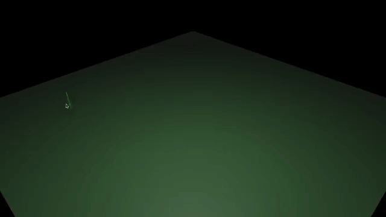

# Bevy Mesh Drawing

**[Experimental ⚠️]** [Bevy][Bevy Engine Website] Plugin to draw polygonal meshes.



## Quick Start

```rust
/// Add canvas and camera...
fn setup(mut commands: Commands) {
    commands.spawn((
            Name::new("Ground Canvas"),
            PbrBundle { .. },
            Canvas, // Canvas Marker.
        ));
    commands.spawn((
        Name::new("Camera"),
        Camera3dBundle { .. },
        MeshDrawingCamera, // Camera Marker.
    ));
}

/// Meshes will be created with [`PolygonalMesh`]
fn handle_polygonal_mesh_add(query: Query<Entity, Added<PolygonalMesh>>) {
    for entity in query.iter() {
        // Use the created mesh here...
    }
}
```

Checkout [`simple.rs`](./examples/simple.rs) in [examples](./examples/).

## Versions

| bevy | bevy_mesh_drawing |
| ---- | ----------------- |
| 0.8  | 0.1.0             |

[Bevy Engine Website]: https://bevyengine.org/
